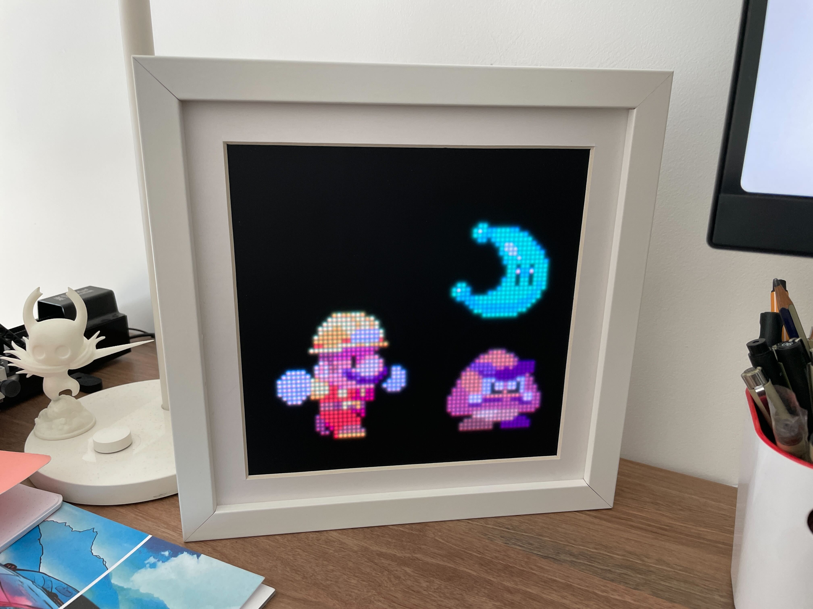
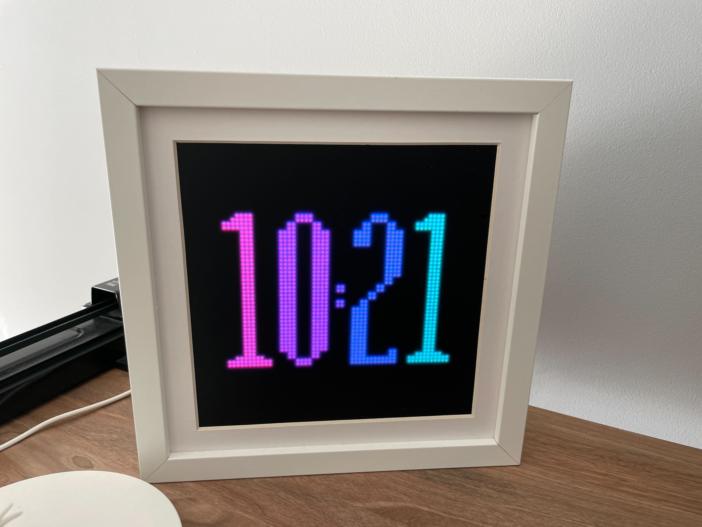
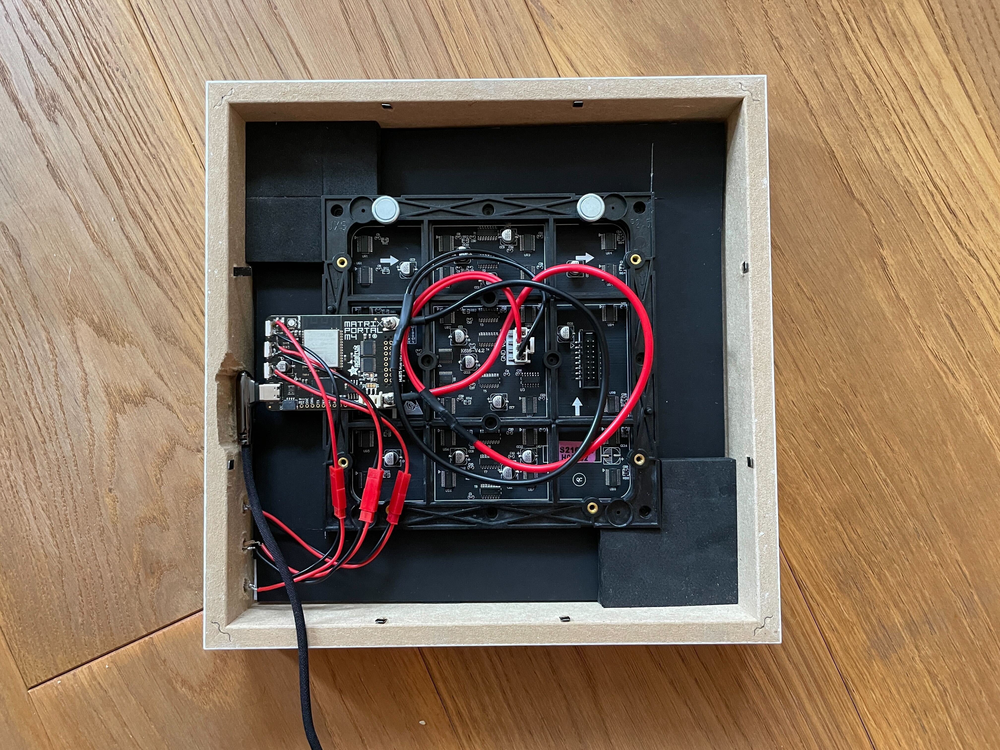

# Retro Frame

DIY pixel art frame, inspired by [Game Frame](https://ledseq.com/product/game-frame/).

Check a few more images and videos [here](https://imgur.com/a/cLXGWWd).

There is a similar project you might want to check out:

- https://github.com/hanneslinder/esp-pixel-matrix

## Intro

The brain is [Adafruit MatrixPortal M4](https://www.adafruit.com/product/4745), ESP32 based controller. You'll need to follow Adafruit's documentation to install Circuit Python. Then you can copy the code (don't forget to create `src/settings.py`).

Files you'll need to copy to your MatrixPortal are:

Rename `src/settings_example.py` to `src/settings.py`. If you want frame to connect to internet in order to fetch the correct time add your network name, password, and `skip_connection=False`.

Then copy the following files and folders:

- `code.py` and `src/*.py` (see `copy.bat|sh`)
- `firmware/[current_version]/lib` to `lib`
- `assets` (which includes splash screen and digital clock sprite)
- `gif` (pick and choose animations you like)

## Apps

There are four apps:

- Gif player (runs each animation for 5 minutes then switches to the next one)
- Digital clock (needs internet connection to get time)
- Analogue clock (needs internet connection to get time)
- Blank - used to preserve power during the night

By default, display will switch to the digital clock at 23:30, to blank at midnight and to gif player at 8:30 in the morning. Check [src/settings_example.py](./src/settings_example.py) and copy it `src/settings.py`. Then update it to your preferences.

### Controls

Tilting the display **left** and **right** will cycle between the apps (button **up** will do the same).

Tilting the display **back** and **forward** will (button **down** will do the same):
- Gif app - switch between gifs
- Digital clock - switch between 12 and 24 hours clock modes

## List of parts

This is a list of all of the main parts with the links to the ones I used.

- Adafruit MatrixPortal M4 https://www.adafruit.com/product/4745
- 64x64 RGB LED Matrix - 2.5mm Pitch - 1/32 Scan - https://www.adafruit.com/product/3649 or https://www.aliexpress.com/item/32816409052.html
- LED diffuser - https://www.adafruit.com/product/4594
- USB C charger - I had one lying around
- The display fits into the IKEA SANNAHED picture frame. But check [frame-1.png](./random-backup-files/frame/frame-1.png) for a custom frame blueprints.
- USB C cable - https://www.aliexpress.com/item/1005002105030431.html
- You can control the display by tilting it, but if you want to add buttons, I used these in the first version - https://www.aliexpress.com/item/4000043687021.html

## Art credits

If I included your art and you want it removed, I'm sorry, just open an issue and I'll take care of it. The only reason I included your work in the first place, is because it is awesome and it makes me happy.

### Other people:

- [Bear](https://rephildesign.tumblr.com/post/120859307063/filbertgames-this-is-what-happens-when-you)
- [Dog](https://dribbble.com/shots/2367354-Doggy-Rabbit)
- [Dota emojis (diretide, giff, es)](https://dota2.fandom.com/wiki/Emoticons)
- Earth and Moon - generated using wonderful [PixelPlanets](https://github.com/Deep-Fold/PixelPlanets)
- [Ember Spirit](https://33.media.tumblr.com/3f53a2565f16799b155d33072ef5fca0/tumblr_nalmwaJGah1sgajexo2_250.gif)
- [Firepit](https://old.reddit.com/r/warcraft3/comments/f3b6fw/warcraft_2_footman_remaster/)
- [Fox](https://elthen.itch.io/2d-pixel-art-fox-sprites)
- [Hollow Knight](https://www.deviantart.com/haykira/art/Hallownest-Fellas-841502305)
- [Jim](https://hani-amir.com/blog/2017/2/7/pixel-art-animation-basics-5-classic-side-scrolling-walking-running-animations-from-the-snes-era)
- [Link](https://www.deviantart.com/world-of-noel/art/Linked-Seasons-Link-361192040)
- [Madeline](https://rephil.dribbble.com/)
- [Mario chase](https://rephil.dribbble.com/)
- [Mario jumping](https://pug-of-war.tumblr.com/post/116535010016/its-a-me-ah-mario)
- [Mega Man](https://www.deviantart.com/bionicandrew1/art/MegaMan-MvC-Moves-736040903)
- [Nyan cat](https://www.nyan.cat/credits.php)
- [Ori](https://twitter.com/WoostarsPixels/status/1543954734108872705?cxt=HHwWgsC8vdCpne0qAAAA)
- [Rafael](https://adamklingpixel.weebly.com/)
- [Robin](http://www.playiconoclasts.com/)
- [Spinning skull](https://www.artstation.com/artwork/ykRDB3)
- [The One Ring](https://dribbble.com/shots/3273233-The-One-Ring)
- [WC2 Footman](https://old.reddit.com/r/PixelArt/comments/7d0y1p/oc_fireplace_animation/)

### Myself

- Splash screen
- Clock digits
- [Pulsar](https://muffinman/pulsar) animations
- Totoro - heavily inspired by [this one](https://www.deviantart.com/andrewjohnnnn/art/Totoro-Rain-GIF-613239881)
- Tutur, in loving a memory of Artur <3
