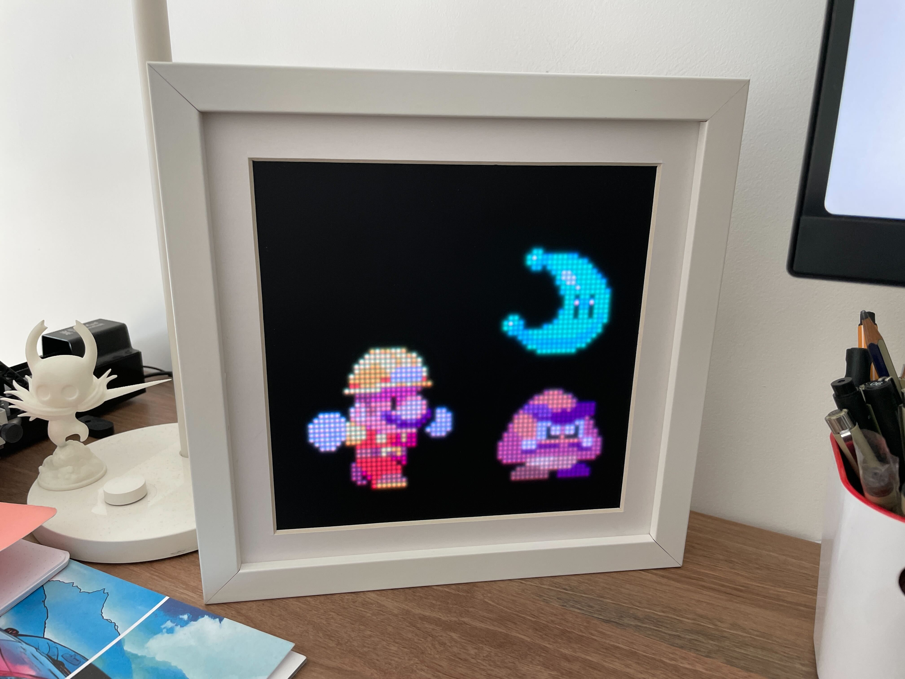
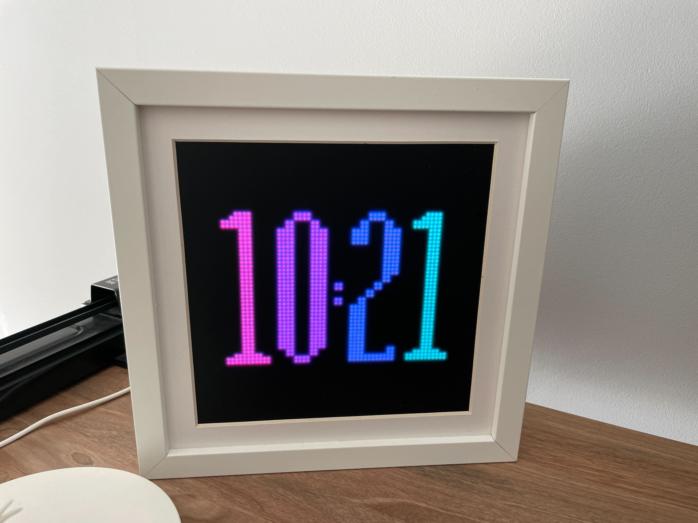
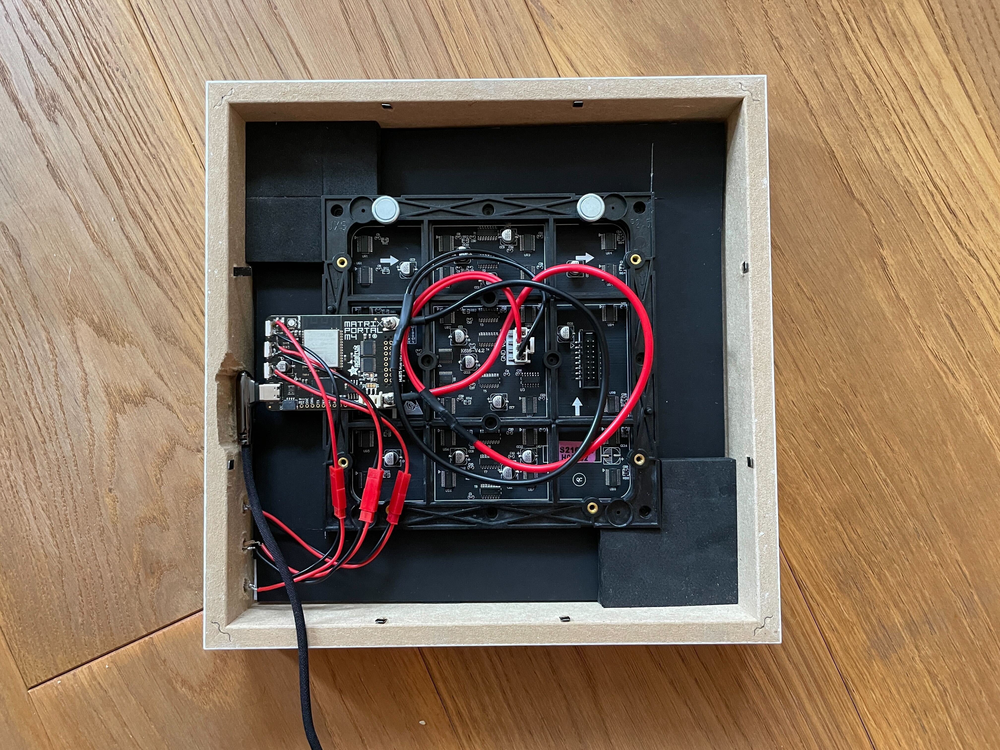

# Retro Frame

DIY pixel art frame, inspired by [Game Frame](https://ledseq.com/product/game-frame/).

Check a few more images and videos [here](https://imgur.com/a/cLXGWWd).

## Disclaimer

Repo was never really prepared for open sourcing, meaning there are a lot of junk/temporary files lying around and missing documentation. This was my first ever python project, so the code is probably not the cleanest you ever saw.

There is a similar project you might want to check out:

- https://github.com/hanneslinder/esp-pixel-matrix

## Intro

The brain is [Adafruit MatrixPortal M4](https://www.adafruit.com/product/4745), ESP32 based controller. You'll need to follow Adafruit's documentation to install Circuit Python. Then you can copy my code (don't forget to create `secrets.py` if you want the display to connect to the internet).

Files you'll need to copy to your MatrixPortal are:

- `code.py`
- `lib`
- `clock/sprite.bmp`
- `secrets.py` (rename `secrets-example.py` and add your network name and password)
- `bmp` (pick and choose animation sprites you like)

## Modes

There are three modes:

- Slideshow (runs each animation for 5 minutes then switches to the next one)
- Clock mode (needs internet connection to get time)

Button `up` will cycle between these three modes. Button `down` will change between animations in the first two modes and try to update time in the clock mode.

By default, at midnight frame will switch to the clock mode and go back to the slideshow mode at nine in the morning.

## List of parts

This is a list of all of the main parts with the links to the ones I used.

- Adafruit MatrixPortal M4 https://www.adafruit.com/product/4745
- 64x64 RGB LED Matrix - 2.5mm Pitch - 1/32 Scan - https://www.adafruit.com/product/3649
- LED diffuser - https://www.adafruit.com/product/4594
- USB C charger - I had one lying around
- IKEA SANNAHED picture frame
- Buttons - https://www.aliexpress.com/item/4000043687021.html
- USB C cable - https://www.aliexpress.com/item/1005002105030431.html

## Art credits

If I included your art and you want it removed, I'm sorry, just open an issue and I'll take care of it. The only reason I included your work in the first place, is because it is awesome and it makes me happy.

### Other people:

- [Bear](https://rephildesign.tumblr.com/post/120859307063/filbertgames-this-is-what-happens-when-you)
- [Dog](https://dribbble.com/shots/2367354-Doggy-Rabbit)
- [Dota emojis (diretide, giff, es)](https://dota2.fandom.com/wiki/Emoticons)
- Earth and Moon - generated using wonderful [PixelPlanets](https://github.com/Deep-Fold/PixelPlanets)
- [Ember Spirit](https://33.media.tumblr.com/3f53a2565f16799b155d33072ef5fca0/tumblr_nalmwaJGah1sgajexo2_250.gif)
- [Haunted pumpkin](https://pixeljoint.com/pixelart/25807.htm)
- [Hollow Knight](https://www.deviantart.com/haykira/art/Hallownest-Fellas-841502305)
- [Jim](https://hani-amir.com/blog/2017/2/7/pixel-art-animation-basics-5-classic-side-scrolling-walking-running-animations-from-the-snes-era)
- [Jumping pumpkin](https://pixeljoint.com/pixelart/15445.htm)
- [Link](https://www.deviantart.com/world-of-noel/art/Linked-Seasons-Link-361192040)
- [Madeline](https://rephil.dribbble.com/)
- [Mario chase](https://rephil.dribbble.com/)
- [Mario jumping](https://pug-of-war.tumblr.com/post/116535010016/its-a-me-ah-mario)
- [Mega Man](https://www.deviantart.com/bionicandrew1/art/MegaMan-MvC-Moves-736040903)
- [Nyan cat](https://www.nyan.cat/credits.php)
- [Ori](https://twitter.com/WoostarsPixels/status/1543954734108872705?cxt=HHwWgsC8vdCpne0qAAAA)
- [Rafael](https://adamklingpixel.weebly.com/)
- [Robin](http://www.playiconoclasts.com/)
- [Spinning skull](https://www.artstation.com/artwork/ykRDB3)
- [The One Ring](https://dribbble.com/shots/3273233-The-One-Ring)

### Myself

- Splash screen
- Clock digits
- Totoro - heavily inspired by [this one](https://www.deviantart.com/andrewjohnnnn/art/Totoro-Rain-GIF-613239881)
- Tutur, in loving a memory of Artur <3
